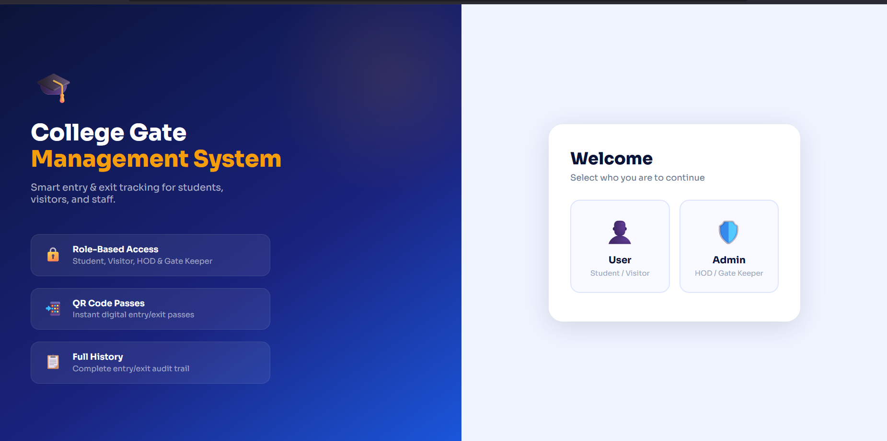
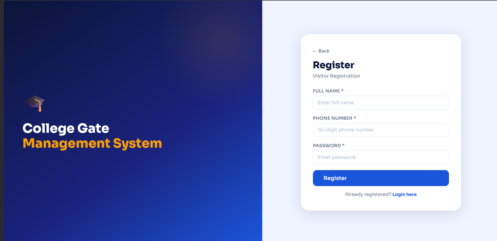
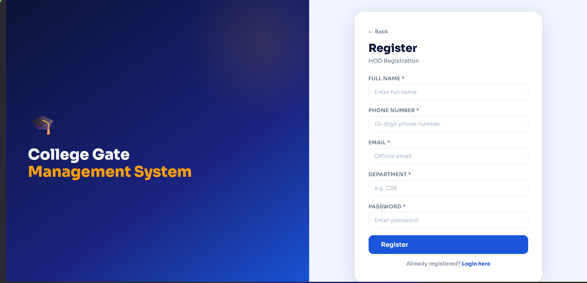
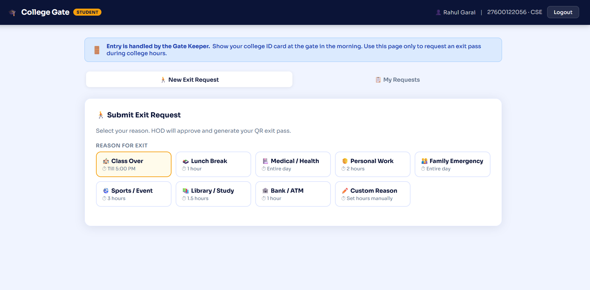
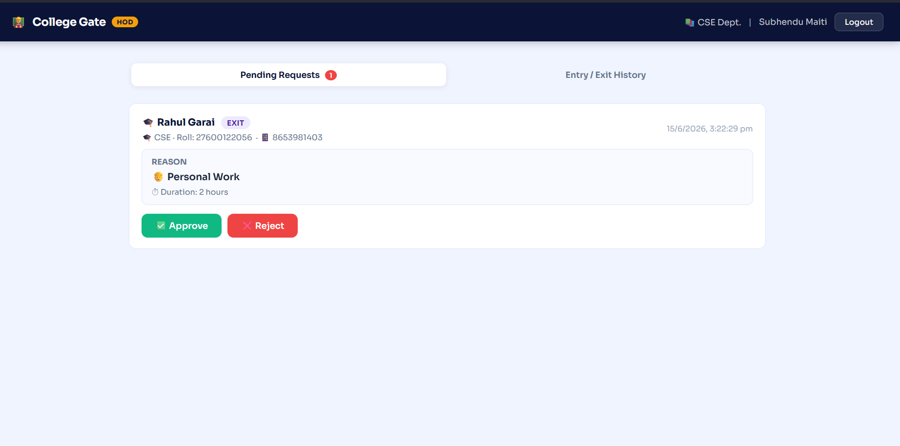
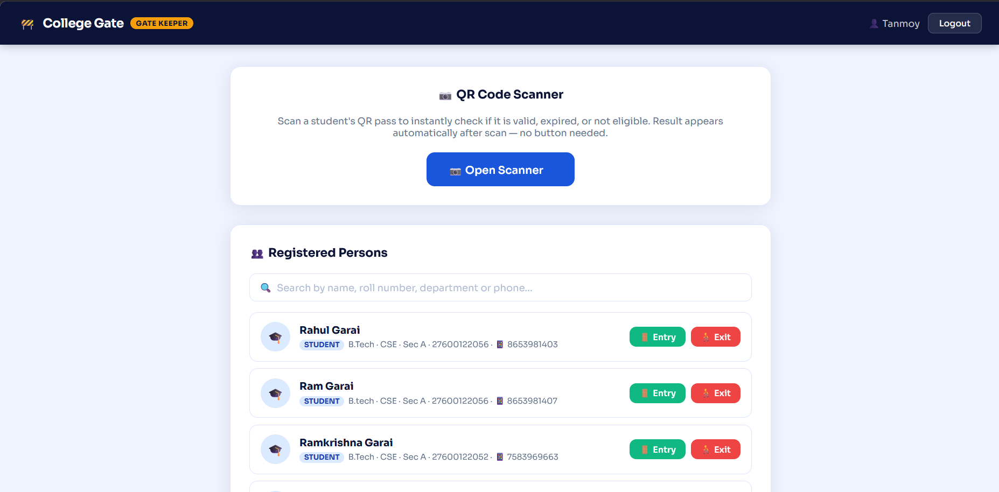
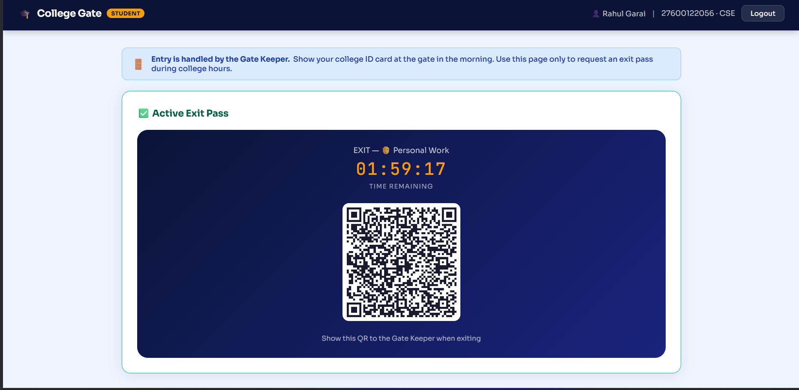
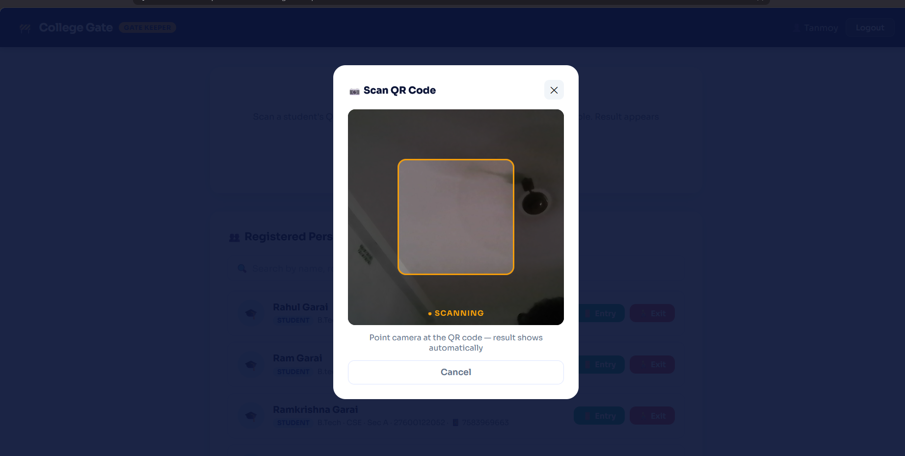
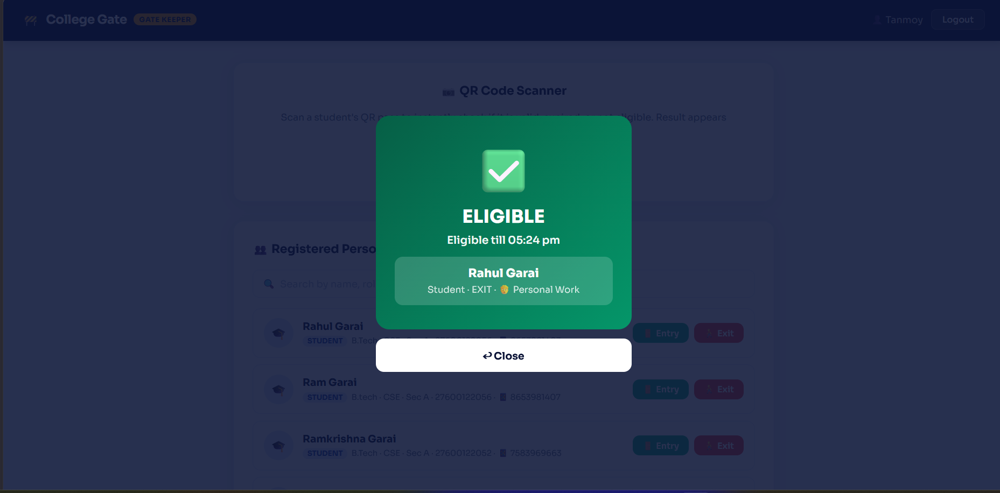

# 🚪 Digital Gate Pass System

<div align="center">


### 🔐 Secure Digital Gate Pass Management System

A modern web application that automates gate pass generation, approval, and verification using QR Code technology.

</div>

---

# 📖 Overview

The **Digital Gate Pass System** is a secure and user-friendly web application designed to replace traditional paper-based gate passes with a fully digital solution.

The system allows students and visitors to request gate passes online, which are reviewed and approved by the Head of Department (HOD) or the Administrator. Once approved, a unique QR Code is generated that can be scanned by the Gatekeeper to verify the authenticity of the pass before allowing entry or exit.

The application improves security, reduces paperwork, speeds up approvals, and maintains complete digital records of every gate pass request.

---

# ✨ Features

- ✅ Student Registration
- ✅ Visitor Registration
- ✅ Secure Login & Authentication
- ✅ Role-Based Access Control
- ✅ Student Dashboard
- ✅ User Dashboard
- ✅ HOD Dashboard
- ✅ Admin Dashboard
- ✅ Gatekeeper Dashboard
- ✅ Digital Gate Pass Generation
- ✅ QR Code Generation
- ✅ QR Code Verification
- ✅ Real-time QR Code Scanning
- ✅ Gate Pass Approval Workflow
- ✅ MongoDB Database Storage
- ✅ Responsive User Interface

---

# 🚀 Technologies Used

## 🎨 Frontend

- React.js
- HTML5
- CSS3
- JavaScript

---

## ⚙️ Backend

- Node.js
- Express.js
- REST API

---

## 🗄 Database

- MongoDB

---

## 🔒 Authentication

- JSON Web Token (JWT)
- Role-Based Authentication

---

## 📷 QR Code Technology

- QR Code Generator
- QR Code Scanner

---

## 🛠 Development Tools

- Visual Studio Code
- Git
- GitHub
- npm

---

# 🏗 System Architecture

```text
                    User
                      │
                      ▼
             React.js Frontend
                      │
                      ▼
          Node.js + Express Backend
                      │
          ┌───────────┴───────────┐
          │                       │
          ▼                       ▼
     MongoDB Database      QR Code Generator
          │                       │
          └───────────┬───────────┘
                      │
                      ▼
          Gate Pass Verification
                      │
                      ▼
             QR Code Scanning
                      │
                      ▼
             Entry / Exit Approved
```

---

# 💻 Tech Stack Overview

| Layer | Technology | Purpose |
|--------|------------|---------|
| Frontend | React.js | User Interface |
| Backend | Node.js + Express.js | Business Logic |
| Database | MongoDB | Data Storage |
| Authentication | JWT | Secure Login |
| QR Technology | QR Code | Digital Verification |

---

# 📂 Project Structure

```text
Digital-Gate-Pass/

├── backend/
│   ├── config/
│   ├── controllers/
│   ├── middleware/
│   ├── models/
│   ├── routes/
│   ├── utils/
│   ├── package.json
│   └── .env
│
├── frontend/
│   ├── public/
│   ├── src/
│   │   ├── components/
│   │   ├── pages/
│   │   ├── services/
│   │   ├── App.jsx
│   │   └── main.jsx
│   ├── package.json
│   └── .env
│
├── ScreenShots/
│
└── README.md
```

---

# ⚙️ Installation Guide

## Step 1 : Clone the Repository

```bash
git clone https://github.com/Ramkrishna-527/Digital-Gate-Pass.git
```

---

## Step 2 : Navigate into the Project

```bash
cd Digital-Gate-Pass
```

---

## Step 3 : Install Backend Dependencies

```bash
cd backend
npm install
```

---

## Step 4 : Install Frontend Dependencies

```bash
cd ../frontend
npm install
```

---

## Step 5 : Configure Environment Variables

Create the required `.env` files and configure:

- MongoDB Connection URL
- JWT Secret Key
- Backend API URL

---

## Step 6 : Start the Backend Server

```bash
cd backend
npm start
```

---

## Step 7 : Start the Frontend

```bash
cd frontend
npm run dev
```

---

## Step 8 : Open the Application

Visit the application in your browser:

```
http://localhost:5173
```

The **Digital Gate Pass System** is now ready to use.

---

# 👨‍💻 User Manual

Follow the steps below to use the Digital Gate Pass System.

---

## 🏠 Step 1 : Open the Application

Launch the application in your web browser.

```
http://localhost:5173
```

The landing page provides access to all available user roles.

---

## 👤 Step 2 : User Registration

New users can register according to their role.

The system supports:

- 👨‍🎓 Student Registration
- 🧑 Visitor Registration
- 👨‍🏫 HOD Registration

After successful registration, users can log in using their credentials.

---

## 🔐 Step 3 : Login

Select your role and log in.

Supported roles:

- Student
- User
- HOD
- Gatekeeper
- Admin

After authentication, each user is redirected to their respective dashboard.

---

## 📝 Step 4 : Gate Pass Request

Students or visitors can create a new gate pass request by entering:

- Name
- Purpose of Visit
- Date
- Time
- Destination
- Additional Remarks (Optional)

After submission, the request is forwarded for approval.

---

## ✅ Step 5 : Approval Process

The HOD or Administrator reviews each request.

They can:

- Approve the request
- Reject the request
- View request details

Once approved, the system automatically generates a unique QR Code.

---

## 📱 Step 6 : QR Code Generation

A secure QR Code is generated containing the gate pass details.

The generated QR Code can be downloaded or displayed directly from the dashboard.

---

## 📷 Step 7 : QR Code Scanning

The Gatekeeper opens the QR Scanner module.

The QR Code is scanned using the camera.

The system verifies:

- Pass validity
- User details
- Approval status
- Expiry information

---

## 🚪 Step 8 : Entry / Exit Verification

If the QR Code is valid,

✅ Entry / Exit is allowed.

Otherwise,

❌ Access is denied.

---

## 📊 Step 9 : Dashboard

Each dashboard provides different functionalities.

### 👨‍🎓 Student Dashboard

- Request Gate Pass
- View Request Status
- Download QR Code
- View History

---

### 👨‍🏫 HOD Dashboard

- View Requests
- Approve Requests
- Reject Requests
- Manage Students

---

### 🛡 Admin Dashboard

- Manage Users
- Manage Students
- Manage Gatekeepers
- System Monitoring
- View Reports

---

### 🚪 Gatekeeper Dashboard

- Scan QR Code
- Verify Gate Pass
- Allow Entry
- Reject Invalid Pass

---

# 🔄 Workflow

```text
          Student / Visitor
                  │
                  ▼
      Submit Gate Pass Request
                  │
                  ▼
         HOD / Admin Review
                  │
        ┌─────────┴──────────┐
        │                    │
    Approved             Rejected
        │
        ▼
 QR Code Generated
        │
        ▼
 Gatekeeper Scans QR
        │
        ▼
 QR Code Verification
        │
        ▼
 Entry / Exit Allowed
```

---

# 📷 Application Screenshots

## 🏠 Landing Page





---

## 👨‍🎓 Student Registration


---

## 🧑 Visitor Registration




---

## 👨‍🏫 HOD Registration





---

## 👨‍🎓 Student Dashboard





---

## 👨‍🏫 HOD Dashboard





---

## 🛡 Admin Dashboard


---

## 🚪 Gatekeeper Dashboard





---

## 👤 User Dashboard


---

## 📱 Generated QR Code





---

## 📷 QR Code Scanner





---

## ✅ QR Verification Result





---

> **Note:** Ensure all screenshots are placed inside the `ScreenShots` folder with the exact filenames shown above.

---

# 🎯 Key Highlights

- 🔐 Secure Authentication using JWT
- 📱 QR Code Based Gate Pass
- 📷 Real-time QR Code Verification
- 👨‍🎓 Student & Visitor Registration
- 👨‍🏫 HOD Approval Workflow
- 🛡 Admin Management Panel
- 🚪 Gatekeeper Verification Module
- 📊 Digital Record Management
- 💻 Responsive User Interface
- 🗄 MongoDB Database Integration

---

# 🚀 Future Enhancements

The following features can be incorporated in future versions of the Digital Gate Pass System:

- 📱 Mobile Application Support
- ☁️ Cloud Deployment (AWS / Azure / GCP)
- 📧 Email Notifications for Gate Pass Approval
- 📲 SMS Notifications
- 🔔 Push Notifications
- 📊 Advanced Analytics Dashboard
- 📈 Gate Pass Statistics & Reports
- 🧑‍💼 Multi-Organization Support
- 🌐 Multi-Language Support
- 🌙 Dark Mode
- 📥 Export Reports as PDF & Excel
- 📍 GPS-Based Gate Verification
- 👤 Biometric Authentication
- 😊 Face Recognition Based Verification
- 🎥 CCTV Camera Integration
- 🤖 AI-Based Visitor Analytics
- 🔒 Two-Factor Authentication (2FA)

---

# 🔒 Security Features

The system incorporates multiple security mechanisms to ensure safe and reliable access.

- JWT Authentication
- Role-Based Access Control
- Secure Password Storage
- Protected Backend APIs
- QR Code Verification
- Session Management
- Input Validation
- Database Security
- Unauthorized Access Prevention

---

# 🎯 Advantages

- Eliminates traditional paper-based gate passes.
- Reduces manual work and paperwork.
- Faster approval process.
- Secure QR Code verification.
- Easy monitoring of visitor records.
- Improves campus security.
- Easy access through different user roles.
- Maintains complete digital records.
- User-friendly interface.
- Scalable architecture for future development.

---

# 📌 Project Modules

The system consists of multiple modules working together.

### 👨‍🎓 Student Module

- Registration
- Login
- Gate Pass Request
- View Pass Status
- Download QR Code

---

### 👨‍🏫 HOD Module

- Login
- View Requests
- Approve Gate Pass
- Reject Gate Pass

---

### 🛡 Admin Module

- Dashboard
- User Management
- Student Management
- HOD Management
- Gatekeeper Management
- Reports

---

### 🚪 Gatekeeper Module

- Login
- QR Code Scanner
- Gate Pass Verification
- Entry & Exit Validation

---

### 👤 Visitor Module

- Visitor Registration
- Request Gate Pass
- QR Code Generation

---

# 📊 Project Highlights

✔ Digital Gate Pass Generation

✔ QR Code Based Verification

✔ Secure Authentication

✔ Multiple User Roles

✔ Admin Dashboard

✔ HOD Approval Workflow

✔ Visitor Management

✔ Student Management

✔ Gatekeeper Verification

✔ Responsive UI

✔ MongoDB Integration

✔ Modern MERN Stack Architecture

---

# 🤝 Contributing

Contributions are always welcome.

If you'd like to improve this project:

1. Fork the repository.
2. Create a new feature branch.
3. Commit your changes.
4. Push your branch.
5. Open a Pull Request.

---

# 📝 License

This project is intended for **educational and research purposes only**.

Feel free to explore, learn from, and extend the project for academic use.

---

# ⭐ Show Your Support

If you found this project helpful,

please consider giving this repository a **⭐ Star** on GitHub.

Your support motivates future development and encourages continuous improvements.

---

# 📬 Contact

For any suggestions, issues, or collaboration opportunities, please feel free to create an Issue or Pull Request in this repository.

---

<div align="center">

# ❤️ Thank You

Thank you for visiting the **Digital Gate Pass System** repository.

We hope this project demonstrates how modern web technologies and secure QR Code-based authentication can simplify and enhance gate pass management in educational institutions and organizations.

### 🌟 If you like this project, don't forget to give it a ⭐ on GitHub!

**Happy Coding! 🚀**

</div>
